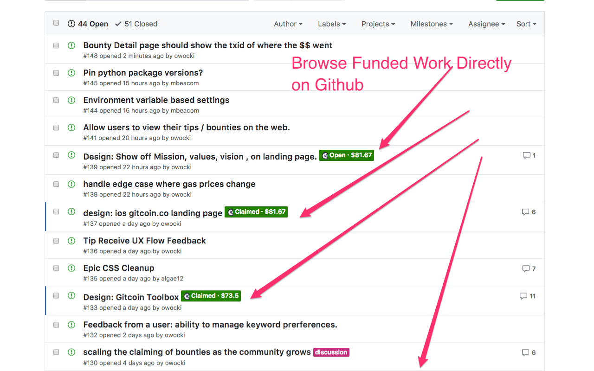
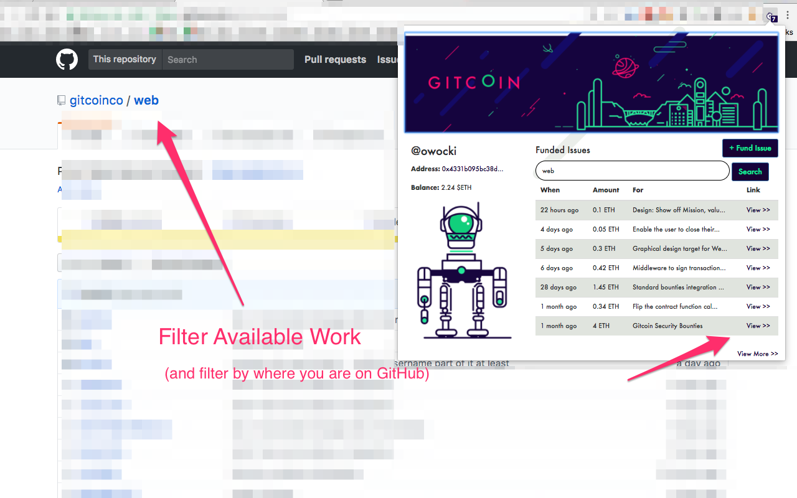
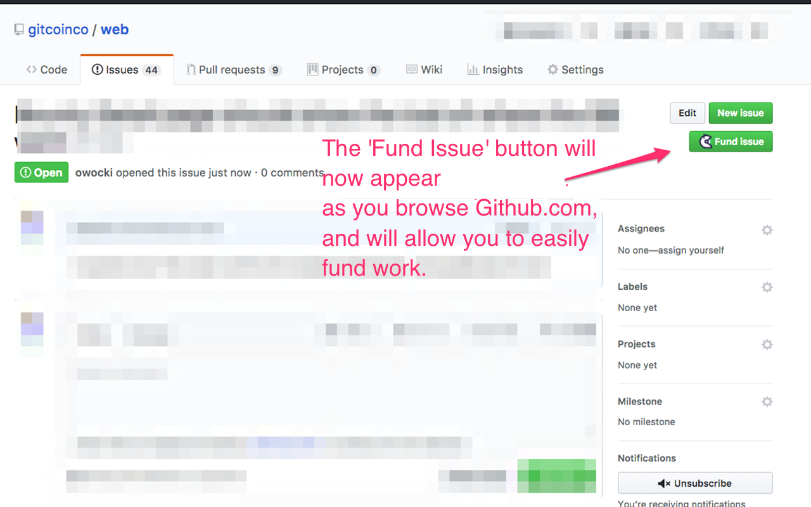
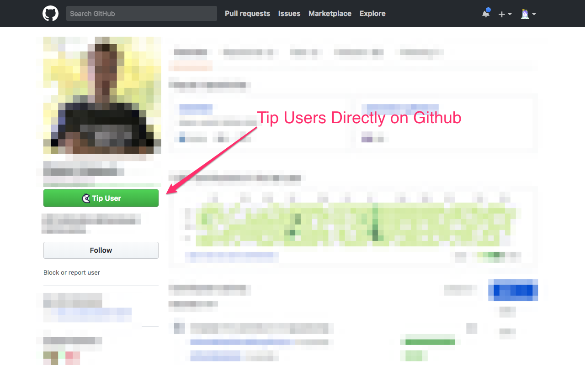

# Gitcoin Web Extension

Gitcoin pushes Open Source Forward.  Learn more at [https://gitcoin.co](https://gitcoin.co)

[Star](https://github.com/gitcoinco/chrome_ext/stargazers) and [watch](https://github.com/gitcoinco/chrome_ext/watchers) this github repository to stay up to date, we're pushing new code several times per week!

## Get It Today on Chrome

The Chrome extension is live on the Google Chrome Store.  [Get it here](https://gitcoin.co/extensions/chrome).

<a href="https://gitcoin.co/extension/chrome">

</a>

## What Does This Extension Do?

### Browse Work Directly on Github



### Filter Available Work from Github



### Fund Work Directly on Github



### Tip Users Direclty on Github



# How to lint the extension

```
npm run lint
```

# Legal

```
    Copyright (C) 2017 Gitcoin Core 

    This program is free software: you can redistribute it and/or modify
    it under the terms of the GNU Affero General Public License as published
    by the Free Software Foundation, either version 3 of the License, or
    (at your option) any later version.

    This program is distributed in the hope that it will be useful,
    but WITHOUT ANY WARRANTY; without even the implied warranty of
    MERCHANTABILITY or FITNESS FOR A PARTICULAR PURPOSE.  See the
    GNU Affero General Public License for more details.

    You should have received a copy of the GNU Affero General Public License
    along with this program.  If not, see <http://www.gnu.org/licenses/>.

```


<!-- Google Analytics -->


